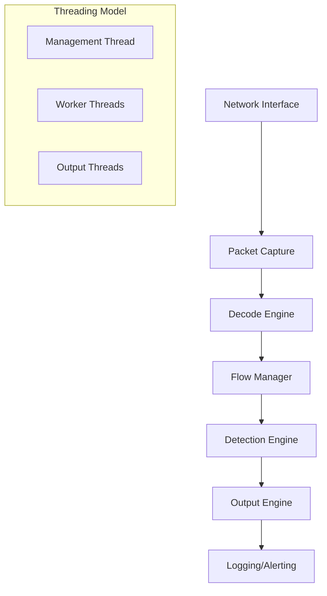

# Suricata Network Security Engine

[](https://github.com/wikimedia/suricata/actions)
[](https://codecov.io/gh/wikimedia/suricata)
[](https://github.com/wikimedia/suricata/security)
[](https://opensource.org/licenses/GPL-2.0)
[](https://doc.wikimedia.org/suricata/)

> **A high-performance, open-source network intrusion detection system (IDS), intrusion prevention system (IPS), and network security monitoring (NSM) engine powering Wikimedia's global infrastructure security.**

## 🌟 Overview

Suricata is a critical component of Wikimedia Foundation's network security infrastructure, protecting Wikipedia, Wikidata, Wikimedia Commons, and hundreds of other Wikimedia projects serving billions of users worldwide. This enterprise-grade security engine provides real-time threat detection, prevention, and monitoring capabilities across Wikimedia's global network infrastructure.

### Key Features

- **🛡️ Multi-Mode Operation**: IDS (detection), IPS (prevention), and NSM (monitoring)
- **⚡ High Performance**: Handles 10Gbps+ traffic with minimal latency
- **🔧 Multi-Threading**: Leverages multi-core systems for optimal performance
- **📊 Rich Logging**: JSON, EVE, and custom formats for SIEM integration
- **🔌 Extensible**: Plugin architecture with Lua scripting support
- **🚀 Hardware Acceleration**: PF_RING, DPDK, XDP/eBPF support
- **🌐 Protocol Support**: Deep packet inspection for 100+ protocols
- **📈 Scalability**: Distributed deployment across multiple data centers

## 📚 Documentation & Resources

### Official Documentation
- 📖 **[Complete Documentation](https://doc.wikimedia.org/suricata/)** - Comprehensive guides and references
- 🚀 **[Quick Start Guide](https://doc.wikimedia.org/suricata/quickstart/)** - Get up and running in minutes
- 🔧 **[Installation Guide](https://doc.wikimedia.org/suricata/installation/)** - Step-by-step installation instructions
- 👩‍💻 **[Developer Guide](https://doc.wikimedia.org/suricata/development/)** - Contributing and development workflows
- 📊 **[Operations Manual](https://doc.wikimedia.org/suricata/operations/)** - Production deployment and monitoring

### Community & Support
- 💬 **[Community Forum](https://forum.wikimedia.org/c/suricata)** - Community discussions and support
- 🐛 **[Issue Tracker](https://phabricator.wikimedia.org/tag/suricata/)** - Report bugs and request features
- 📧 **[Mailing Lists](https://lists.wikimedia.org/postorius/lists/suricata.lists.wikimedia.org/)** - Development and announcements
- 💡 **[RFC Repository](https://github.com/wikimedia/suricata-rfcs)** - Technical proposals and designs
- 🔒 **[Security Contact](mailto:security@wikimedia.org)** - Security vulnerability reports

### Wikimedia Infrastructure
- 🌍 **[Global Network Map](https://meta.wikimedia.org/wiki/Wikimedia_sites)** - Our global presence
- 📈 **[Performance Metrics](https://grafana.wikimedia.org/d/suricata/)** - Real-time monitoring dashboards
- 🔍 **[Traffic Analysis](https://analytics.wikimedia.org/suricata/)** - Network security insights

## 🤝 Contributing to Wikimedia's Security Infrastructure

We welcome contributions from the global community! Suricata protects critical infrastructure serving billions of users, so we maintain high standards for code quality, security, and reliability.

### 🚀 Quick Start for Contributors

1. **📋 Read our [Code of Conduct](https://meta.wikimedia.org/wiki/Code_of_Conduct)**
2. **📝 Sign the [Contributor License Agreement](https://cla.wikimedia.org/)**
3. **🔧 Set up your [development environment](https://doc.wikimedia.org/suricata/development/setup/)**
4. **🐛 Find a [good first issue](https://phabricator.wikimedia.org/tag/suricata-good-first-task/)**
5. **💬 Join our [developer chat](https://chat.wikimedia.org/#/room/#suricata:wikimedia.org)**

### 🎯 Contribution Areas

- **🔒 Security Features**: New detection engines, threat intelligence integration
- **⚡ Performance**: Optimization, profiling, hardware acceleration
- **🌐 Protocol Support**: New protocol parsers and analyzers
- **📊 Analytics**: Logging improvements, visualization tools
- **🧪 Testing**: Unit tests, integration tests, fuzzing
- **📚 Documentation**: User guides, API documentation, tutorials
- **🌍 Internationalization**: Multi-language support for global deployment

### 🛡️ Security Considerations

Suricata is mission-critical infrastructure protecting Wikimedia's services:

- **High Stakes**: IPS mode crashes can impact service availability
- **Security Impact**: Compromises could expose user data or enable attacks
- **Global Scale**: Changes affect infrastructure serving billions of users
- **Threat Landscape**: Direct exposure to sophisticated attack vectors

### 📋 Development Process

Our rigorous QA process ensures reliability and security:

#### Phase 1: Automated Validation
- ✅ **CI/CD Pipeline**: Automated builds across multiple platforms
- 🔍 **Code Quality**: Static analysis, linting, style checks
- 🧪 **Unit Tests**: Comprehensive test suite execution
- 🔒 **Security Scans**: Vulnerability and dependency analysis

#### Phase 2: Code Review
- 👥 **Peer Review**: Multi-reviewer approval process
- 🏗️ **Architecture Review**: Design patterns and system integration
- 📝 **Documentation Review**: Ensure comprehensive documentation
- 🎯 **Performance Review**: Impact analysis on system performance

#### Phase 3: Wikimedia Infrastructure Testing
- 🔒 **Private QA**: Testing with real traffic patterns (confidential)
- 🌐 **Multi-Datacenter**: Validation across global infrastructure
- 📊 **Performance Benchmarks**: Impact analysis on production workloads
- 🛡️ **Security Validation**: Threat simulation and penetration testing

### 🧪 Comprehensive QA Pipeline

Our QA process reflects the critical nature of network security infrastructure:

#### 🏗️ Build Matrix Testing
- **Operating Systems**: Ubuntu, Debian, CentOS, FreeBSD
- **Compilers**: GCC, Clang with various optimization levels
- **Architectures**: x86_64, ARM64, PowerPC
- **Feature Combinations**: All configuration permutations

#### 🔍 Static Analysis Suite
- **Code Quality**: cppcheck, clang-static-analyzer, CodeQL
- **Security Analysis**: Bandit, Semgrep, custom security rules
- **Dependency Scanning**: Snyk, OWASP dependency check
- **License Compliance**: FOSSA, license compatibility validation

#### 🚀 Runtime Analysis
- **Memory Safety**: Valgrind, AddressSanitizer, LeakSanitizer
- **Thread Safety**: ThreadSanitizer, race condition detection
- **Performance Profiling**: Perf, Intel VTune, custom profilers
- **Resource Monitoring**: Memory, CPU, network utilization

#### 🧪 Specialized Testing
- **Regression Suite**: 10,000+ historical bug test cases
- **Protocol Fuzzing**: AFL++, libFuzzer with custom harnesses
- **Traffic Replay**: Multi-gigabit production traffic simulation
- **Stress Testing**: Extended runs with terabyte-scale datasets
- **Chaos Engineering**: Failure injection and recovery testing

#### 🌐 Production Validation
- **Canary Deployments**: Gradual rollout across data centers
- **A/B Testing**: Performance comparison with previous versions
- **Monitoring Integration**: Full observability stack validation
- **Rollback Procedures**: Automated recovery mechanisms

### ⏱️ Timeline Expectations

- **Simple Fixes**: 2-3 days (automated testing only)
- **Feature Additions**: 1-2 weeks (full QA cycle)
- **Major Changes**: 2-4 weeks (extended testing + security review)
- **Critical Security**: Fast-track process (24-48 hours)

### 🔧 Post-Merge Process

- **Continuous Monitoring**: 24/7 production monitoring
- **Performance Tracking**: Automated performance regression detection
- **Security Scanning**: Daily Coverity scans, weekly penetration tests
- **Community Feedback**: Rapid response to user-reported issues

## 🚀 Quick Start

### 📦 Installation

```bash
# Ubuntu/Debian
sudo apt update && sudo apt install suricata-wikimedia

# CentOS/RHEL
sudo yum install suricata-wikimedia

# From source
git clone https://github.com/wikimedia/suricata.git
cd suricata
./autogen.sh && ./configure --enable-all-features
make -j$(nproc) && sudo make install
```

### ⚡ Basic Usage

```bash
# Start in IDS mode
sudo suricata -c /etc/suricata/suricata.yaml -i eth0

# Start in IPS mode
sudo suricata -c /etc/suricata/suricata.yaml -q 0

# Process pcap file
suricata -c /etc/suricata/suricata.yaml -r capture.pcap

# Configuration validation
suricata -T -c /etc/suricata/suricata.yaml
```

### 🔧 Configuration

```yaml
# /etc/suricata/suricata.yaml (minimal example)
vars:
  address-groups:
    HOME_NET: "[10.0.0.0/8,172.16.0.0/12,192.168.0.0/16]"
    EXTERNAL_NET: "!$HOME_NET"

outputs:
  - eve-log:
      enabled: yes
      filetype: regular
      filename: /var/log/suricata/eve.json
      types:
        - alert
        - flow
        - tls

rule-files:
  - /var/lib/suricata/rules/wikimedia.rules
  - /var/lib/suricata/rules/emerging-threats.rules
```

## 🏗️ Architecture

### 🔄 Processing Pipeline



### 🧩 Core Components

- **📥 Packet Acquisition**: Multi-threaded packet capture (AF_PACKET, PF_RING, DPDK)
- **🔍 Protocol Detection**: Deep packet inspection with protocol-aware parsing
- **🛡️ Detection Engine**: Rule-based pattern matching with Hyperscan acceleration
- **📊 Flow Analysis**: Stateful connection tracking and analysis
- **📝 Logging Framework**: Structured logging with JSON/EVE output formats
- **🔌 Plugin System**: Extensible architecture with Lua scripting support

## 🌍 Wikimedia Integration

### 📈 Scale & Performance

- **Traffic Volume**: 500+ Gbps peak traffic across global infrastructure
- **Detection Rules**: 50,000+ custom and community rules
- **Events Per Second**: 1M+ security events processed
- **Global Presence**: 6 core data centers, 300+ edge locations
- **Uptime**: 99.95% availability SLA

### 🔧 Custom Features

- **MediaWiki Integration**: Application-aware security rules
- **Wikimedia Analytics**: Custom logging for security analytics
- **Multi-tenant Support**: Project-specific security policies
- **Global Threat Intelligence**: Community-driven rule sharing
- **Performance Optimization**: Custom patches for high-volume deployments

## ❓ Frequently Asked Questions

### 🔄 **Will my contribution be accepted?**
We welcome all contributions that align with Wikimedia's mission and maintain our security standards. Acceptance depends on:
- Code quality and testing coverage
- Alignment with Wikimedia's technical architecture
- Security impact assessment
- Performance implications
- Community benefit and maintainability

### ⏰ **How long does the review process take?**
- **Bug fixes**: 3-5 business days
- **Feature additions**: 1-2 weeks
- **Major changes**: 2-4 weeks with security review
- **Security patches**: Expedited 24-48 hour process

### 🔄 **Why was my pull request closed?**
PRs may be closed for several reasons:
- **CI/CD Failures**: Automated tests must pass before review
- **Incomplete Documentation**: All changes require documentation updates
- **Security Concerns**: Security team review required for certain changes
- **Architecture Mismatch**: Changes must align with system architecture

We provide detailed feedback and encourage resubmission with improvements.

### 🛠️ **Tool conflicts and false positives?**
Our QA automation requires clean builds:
- **Zero tolerance** for compiler warnings (use pragmas for false positives)
- **Static analysis** issues must be resolved or suppressed with justification
- **Performance regressions** require optimization or phased rollout plan
- **Security findings** must be addressed before merge

### 📝 **Contributor License Agreement (CLA)?**
Yes, all contributors must sign our CLA to maintain clear intellectual property rights:
- **Individual CLA**: For personal contributions
- **Corporate CLA**: For employer-sponsored contributions
- **Digital Signing**: Quick online process via [CLA Assistant](https://cla.wikimedia.org/)
- **Legal Protection**: Ensures Wikimedia can defend the project legally

### 🌐 **How does this relate to the broader Suricata project?**
Wikimedia maintains this fork with:
- **Upstream Compatibility**: Regular rebasing with upstream releases
- **Custom Enhancements**: Wikimedia-specific optimizations and features
- **Community Contributions**: Upstreaming valuable improvements
- **Security Hardening**: Additional security measures for public infrastructure

### 🔒 **Security vulnerability reporting?**
- **Private Disclosure**: Email security@wikimedia.org for sensitive issues
- **Coordinated Disclosure**: 90-day disclosure timeline
- **Bug Bounty**: Eligible issues may qualify for rewards
- **Public Issues**: Use Phabricator for non-sensitive security improvements

---

## 📄 License & Legal

**License**: GNU General Public License v2.0 ([GPL-2.0](https://opensource.org/licenses/GPL-2.0))

**Copyright**: © Wikimedia Foundation, Inc. and contributors

**Trademark**: Suricata is a trademark of the Open Information Security Foundation

**Privacy**: See [Wikimedia Privacy Policy](https://foundation.wikimedia.org/wiki/Privacy_policy)

---

<div align="center">

**🌟 Built with ❤️ by the Wikimedia Community 🌟**

[Website](https://www.wikimedia.org/) • [Documentation](https://doc.wikimedia.org/suricata/) • [Community](https://meta.wikimedia.org/wiki/Wikimedia_community) • [Contribute](https://www.mediawiki.org/wiki/How_to_contribute)

*Protecting the free knowledge of the world, one packet at a time.*

</div>
